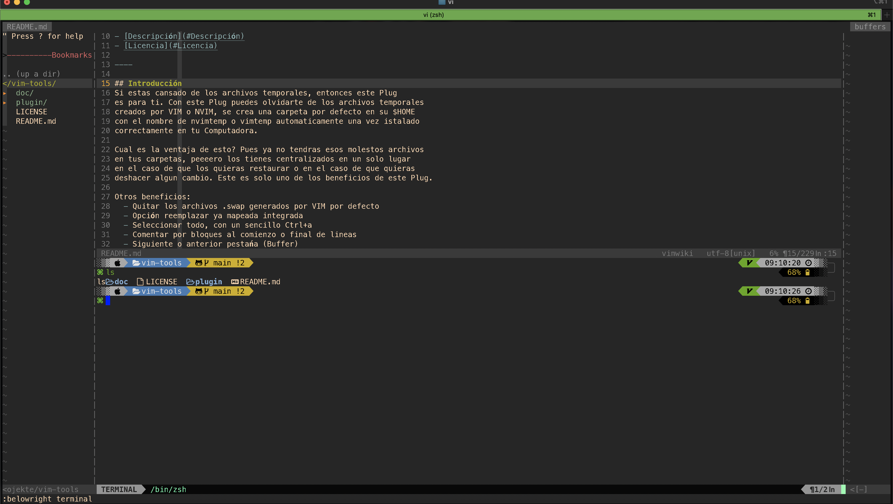

[](https://www.youtube.com/channel/UC_mYh5PYPHBJ5YYUj8AIkcw)
<div align="center">
  <br> <h1>⚙️  vim-tools 🛠 </h1>
</div>

<h4 align="center">
  <a> compatibilidad 👉 </a>
  <a href="https://www.vim.org/download.php" target="_blank"><code>Vim</code></a>
  <a href="https://github.com/macvim-dev/macvim" target="_blank"><code>MacVim</code></a>
  <a href="https://github.com/neovim/neovim" target="_blank"><code>NVim</code></a>
</h4>

<div align="right">
  <sub>Author:
  <a href="https://twitter.com/mctechnology17">MC Technology</a>
</div>
<br>

- [English](README.md)
- [Intro](#Intro)
- [Fotos](#Fotos)
- [Installation](#Installation)
- [Description](#Description)
- [LICENSE](#LICENSE)

----

## Intro
Si estas cansado de los archivos temporales,
de ningun auto predictor, de las letras chicas en GVim,
del molesto error en Vim de que no guardaste bien lso cambios,
de no recordar com re hace para reemplazar o cambiar palabras,
de que las teclas con "a "o "u en el teclado alemán no tenga una funcionalidad extra,
de siempre excribir :w :q etc? entonces este Plug es para ti.
Con este Plug puedes olvidarte de los archivos temporales
creados para VIM, Vi, GVIm, MacVim y el todo poderoso editor NVIM.

## Installation
1. Instalar Plug si no lo tienes instalado -> [aquí](https://github.com/junegunn/vim-plug)
2. Agregar a tu .vimrc
```vim
call plug#begin('~/.vim/plugged')
Plug 'mctechnology17/vim-tools'
call plug#end()
```
3. Actualizar fuentes e installar
```vim
:so %
:PlugInstall
```


## Description
```vim
" accede a tu .vimrc o init.vim de manera inmediata con las teclas F1 para
" .vimrc o _vimrc si estas en Windows y F2 para init.vim let CONFIG_VIM = $PATH
let CONFIG_NVIM = $PATH

if has('win32')&&!has('win64')
  let $CONFIG_VIM='$HOME/_vimrc'
  let $CONFIG_NVIM='$HOME/AppData/Local/nvim/init.vim'
else
  let $CONFIG_VIM='$HOME/.vimrc'
  let $CONFIG_NVIM='$HOME/.config/nvim/init.vim'
endif
map <F1> :vsp<Space>$CONFIG_VIM<CR>
map <F2> :vsp<Space>$CONFIG_NVIM<CR>

" estabalecer diccionario este se combina con TAB= tabulador para las sugerencias de palabras
if isdirectory('/usr/share/dict/words')
    set dictionary+=/usr/share/dict/words
elseif isdirectory('/usr/local/opt/fzf')
    set rtp+=/usr/local/opt/fzf
endif

if has('win32')&&!has('win64')
    set guifont=Consolas:h12
endif

" se crea una carpeta por defecto en su $HOME
" con el nombre de nvimtemp o vimtemp automaticamente una vez instalado
" correctamente en tu Computadora
" Cual es la ventaja de esto?
" Pues ya no tendras esos molestos archivos
" en tus carpetas, peeeero los tienes centralizados en un solo lugar
" en el caso de que los quieras restaurar o en el caso de que quieras
" deshacer algun cambio. Imaginate que estas escribiendo tu código, lo borraste
" por accidente con el comando rm -rf de la terminal y quieres recuperar ese
" archivos?  " Pues siemplemente te diriges a la ruta $HOME/nvimtmp o
" $HOME/vimtmp dependiendo de tu editor y restauras el archivo!
" Además así no tienes que preocuparte de compartir algo queno quieres!
if has('nvim')
    if !isdirectory($HOME."/nvimtmp")
        call mkdir($HOME."/nvimtmp", "p", 0770)
    endif
    if !isdirectory($HOME."/nvimtmp/undo-dir")
        call mkdir($HOME."/nvimtmp/undo-dir", "p", 0700)
    endif
    set directory=~/nvimtmp//,.
    set backupdir=~/nvimtmp//,.
    set undodir=~/nvimtmp/undo-dir
else
    if !isdirectory($HOME."/vimtmp")
        call mkdir($HOME."/vimtmp", "p", 0770)
    endif
    if !isdirectory($HOME."/vimtmp/undo-dir")
        call mkdir($HOME."/vimtmp/undo-dir", "p", 0700)
    endif
    set directory=~/vimtmp//,.
    set backupdir=~/vimtmp//,.
    set undodir=~/vimtmp/undo-dir
endif
set backup
set undofile
set noswapfile

" reemplazar nunca fue tan facil, simplemente en las primeras xx
" escribes la palabras a reemplazar y en las segundas xx por lo que vas a reemplazar.
" ejemplo:
" :%s/std:://gc
" aquí se reemplazará std:: por nada, para borrar por asi decirlo en tu código,
" la gc es para que te pregunte, si quieres reemplazar tod sin que te preugnte,
" simplemente quita la letra c y todo se reemplazará automaticamente
nmap <Leader>r :%s/xx/xx/gc

" seleccioan todo el texto con Control+a
nnoremap <C-A> ggVG

" map útil para los teclados alemanes, zuisos etc. En los modos normal y visual.
" final de linea= ß
" final de corchetes= $
" primera linea de código= ü
" última linea del código= ä
" NOTA: en el modo VISUAL te ayudara a seleccionar en sus respectivos orden.
nnoremap ß $
vnoremap ß $
nnoremap ö %
vnoremap ö %
nnoremap ü gg
vnoremap ü gg
nnoremap ä G
vnoremap ä G
" siguiente sugerencia de palabras
inoremap <TAB> <C-N>

" guarda y cierra el script de una manera confortable
nmap <Leader>w :w<CR>
nmap <Leader>q :q<CR>

" siguiente Buffer o pestańas o anterio
nmap <Leader>b :bnext<CR>
nmap <Leader>bb :bprev<CR>

" invoca la terminal asi de facil
map <Leader>x :belowright terminal<CR>
nnoremap <Silent> <Leader>sh :terminal<CR>

" mueve bloques de códigos de una manera facil y rapido
vnoremap J :m '>+1<CR>gv=gv
vnoremap K :m '<-2<CR>gv=gv

" para mover con identación de una manera facil
vnoremap < <gv
vnoremap > >gv

" cambia la ruta del $PATH de una manera facil
nnoremap <leader>cd :lcd %:p:h<CR>

" crea un nuevo archivo en la misma direccón de tu $PATH
noremap <Leader>nf :e <C-R>=expand("%:p:h") . "/" <CR>
" invoca un nuevo archivo en la misma direccón de tu $PATH
noremap <Leader>op :tabe <C-R>=expand("%:p:h") . "/" <CR>

" elimina los molestos espacios en blanco de manera automática
" sangría automatica para todos los lenguages
" posición del puntero automático y por suppuesto $PATH automático al
" directorio actual, si el Buffer no lo reconoce, puede cambiarlo von LEADER+cd a
" como se indica arriba
augroup mysettings
  au FileType xslt,xml,css,html,xhtml,javascript,sh,config,c,cpp,docbook set smartindent shiftwidth=2 softtabstop=2 expandtab
  au FileType tex set wrap shiftwidth=2 softtabstop=2 expandtab
  au FileType python set tabstop=4 softtabstop=4 expandtab shiftwidth=4 cinwords=if,elif,else,for,while,try,except,finally,def,class
  au BufRead,BufNewFile *.txt set syntax=conf
  au BufWritePre * %s/\s\+$//e
  au BufWritePre * %s/\n\+\%$//e
  au BufWritePre *.[ch] %s/\%$/\r/e
  au BufReadPost *
        \ if line("'\"") > 0 && line("'\"") <= line("$") |
        \   exe "normal! g`\"" |
        \ endif
  au BufEnter * lcd %:p:h
augroup END

" desactiva elblinking del puntero
set gcr=a:blinkon0
" movimiento entre ventanas abiertas con Control+hjkl o SHIFT+hjkl
map <C-h> <C-w>h
map <C-j> <C-w>j
map <C-k> <C-w>k
map <C-l> <C-w>l
map <S-LEFT> <C-w>h
map <S-DOWN> <C-w>j
map <S-UP> <C-w>k
map <S-RIGHT> <C-w>l

" agranda las ventanas con - o + en el modo normal
nnoremap + 3<C-w>>
nnoremap - 3<C-w><

" usas MacOS? esto te encantará, ahora puedes copiar y pegar con COMMAND+v/c en VIM
if has('macunix')
  vmap <D-c> :!pbcopy<CR>
  nmap <D-c> :!pbcopy<CR>
  vmap <D-c> :w !pbcopy<CR><CR>
  vmap <D-c> :w !pbcopy<CR><CR>
  vmap <D-v> :!pbpaste<CR>
  nmap <D-v> :!pbpaste<CR>
  vmap <D-v> :w !pbpaste<CR><CR>
  vmap <D-v> :w !pbpaste<CR><CR>
endif

" ejecuta tu codigo en Python sin salirte de tu código
" NOTA: solo funciona si no tienes que darle ningun argumento
if has( 'python3' )
  map <Leader>- :belowright term python %<CR>
  map <Leader>-- :tab belowright term python %<CR>
endif

" compila tu código en c con gcc o clang
" NOTA: solo funciona si no tienes que darle ningun argumento
if has('gcc')||has('clang')
  map <Leader>+ :!gcc % -g -v -m64 -Wall -Werror -Wunused-parameter -Wunused-variable -O3 -pedantic -o %<.x<CR><CR>
  nnoremap <silent> <TAB>+ :tab term ./%<.x<CR><CR>
  nnoremap <silent> <TAB>l :!rm -r %<.x.dSYM __pycache__ %<.[ox]<CR><CR>
endif

" compila tu código en cpp con g++ o clang++
" <TAB>+ ejecuta el codigo compilado
" <TAB>l limpia el código compilado y archivos termporales
" NOTA: solo funciona si no tienes que darle ningun argumento
if has('g++')||has('clang++')
  map <Leader>++ :!g++ % -g -v -m64 -Wall -Werror -Wunused-parameter -Wunused-variable -O3 -pedantic -std=c++11 -o %<.x<CR><CR>
  nnoremap <silent> <TAB>+ :tab term ./%<.x<CR><CR>
  nnoremap <silent> <TAB>l :!rm -r %<.x.dSYM __pycache__ %<.[ox]<CR><CR>
endif

" compila tu código en LaTeX con pandoc y abre el resultado inmediatamente
if has('macunix')
  nnoremap <silent> <TAB>p :!pandoc --verbose % -o %<.pdf && open %<.pdf<CR><CR>
  nnoremap <silent> <TAB>l :!pandoc --verbose % -o %<.pdf && open %<.pdf<CR><CR>
elseif has('unix')
  nnoremap <silent> <TAB>p :!pandoc --verbose % -o %<.pdf && xdg-open %<.pdf<CR><CR>
  nnoremap <silent> <TAB>l :!pandoc --verbose % -o %<.pdf && xdg-open %<.pdf<CR><CR>
endif
```

## Fotos



## LICENSE
[Licencia](./LICENSE)
